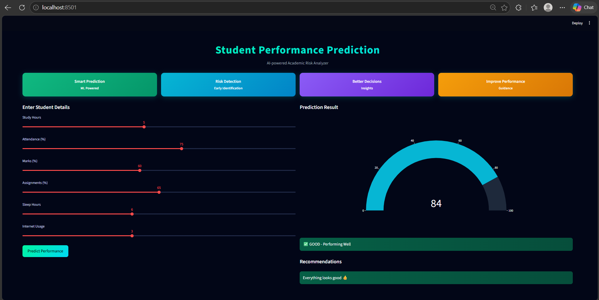
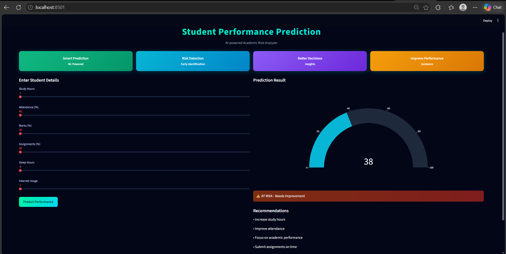
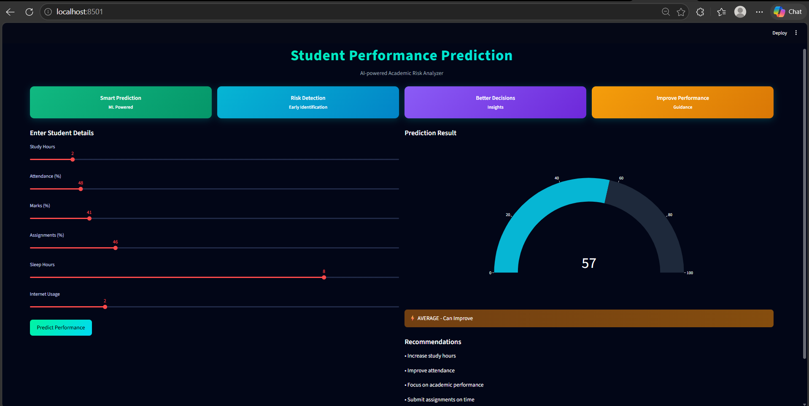
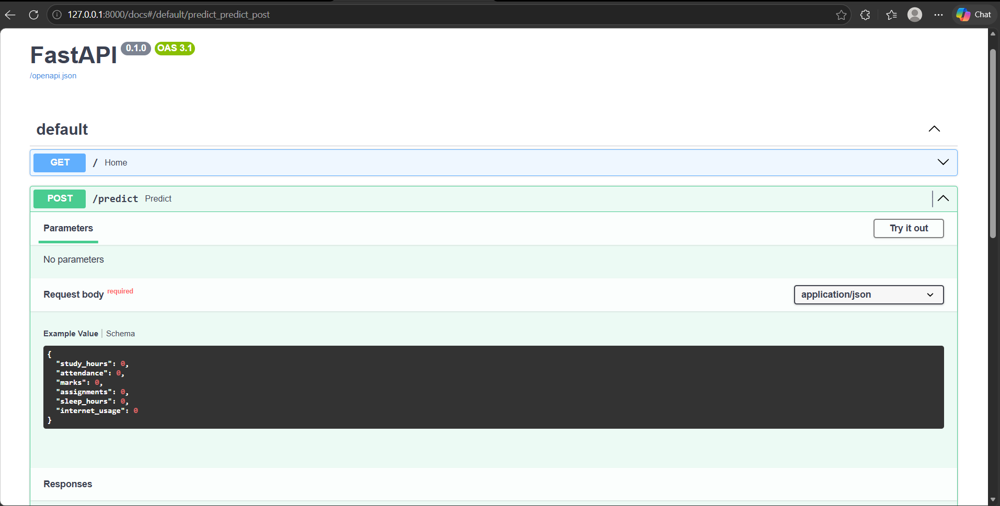

# 🎓 Student Performance Prediction System

A Machine Learning-based system that predicts student academic performance using behavioral and academic features such as study hours, attendance, marks, assignments, sleep patterns, and internet usage.
The system provides a visual performance score, risk classification, and personalized recommendations through an interactive dashboard.

---

## 🚀 Features

* 📊 Predict student performance using Machine Learning
* 📉 Risk detection (At Risk / Average / Good)
* 📈 Interactive dashboard built with Streamlit
* ⚡ REST API using FastAPI
* 💡 Personalized recommendations based on input data
* 🎯 Visual gauge score for better understanding

---

## 🛠 Tech Stack

* Python
* Scikit-learn
* Streamlit
* FastAPI
* Plotly
* Pandas
* Joblib

---

## ⚙️ Architecture

* **Streamlit** → Frontend UI for user interaction
* **FastAPI** → Backend API for prediction serving
* **Scikit-learn** → Machine Learning model training and inference
* **Plotly** → Data visualization (gauge chart)

---

## 📂 Project Structure

```
Student-Performance-Prediction/
│
├── app.py                # Streamlit UI
├── requirements.txt
├── README.md
│
├── data/
│   └── student_data.csv
│
├── models/
│   └── model.pkl
│
├── src/
│   ├── train.py
│   ├── predict.py
│   ├── evaluate.py
│   └── data_generation.py
│
├── serving/
│   └── app.py           # FastAPI API
│
└── images/
    ├── api.png
    ├── at_risk.png
    ├── average.png
    └── performing_well.png
```

---

## 📊 How It Works

1. User enters student details (study hours, attendance, etc.)
2. Machine Learning model predicts performance
3. A score (0–100) is calculated and displayed
4. Performance category is shown (At Risk / Average / Good)
5. System generates personalized recommendations

---

## 🖥️ Application Screenshots

### 🔹 Dashboard Output



### 🔹 At Risk Prediction



### 🔹 Average Performance



### 🔹 API Response



---

## ▶️ Run Streamlit App

```
streamlit run app.py
```

---

## ▶️ Run FastAPI Server

```
uvicorn serving.app:app --reload
```

---

## 📌 Output

* Performance Score (0–100)
* Category (At Risk / Average / Good)
* Visual Gauge Chart
* Personalized Recommendations

---

## 🌐 Future Improvements

* Use real-world dataset
* Deploy on cloud (Streamlit Cloud / Render)
* Add authentication system
* Improve model accuracy with advanced ML algorithms

---

## 👩‍💻 Author

Swetha K

